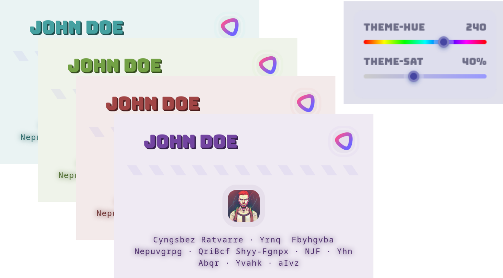

<div align="center">
  
  <h1>⌞⌃⌄⌝</h1>
  <i><small>jsonresume theme v7.x</small></i><br>
  <a href="https://metaory.github.io/jsonresume-theme-legacy">demo</a> |
  <a href="out/sample.pdf">sample.pdf</a>
</div>

<p align="center">
  
</p>

---

## USAGE

```sh
# clone
git clone git@github.com:metaory/jsonresume-theme-legacy.git

# navigate
cd jsonresume-theme-legacy

# install dependencies
npm install

# run development
npm run dev

# view sample page
http://localhost:5173

# build sample pdf
npm run build:sample

# duplicate the resume data
cp src/pages/index.json src/pages/private.json

# update the resume data
nvim src/pages/private.json

# customize theme (optional)
# set "theme-hue": 120 and "theme-sat": 5 in meta.themeOptions (JSON-first)
# starts in light mode (matches PDF exports)

# view newly created page
http://localhost:5173/private

# build private pdf
npm run build:private

# optimize and version pdf (creates: private.{USER}.v{VERSION}.pdf)
npm run optimize:pdf

# or combine both steps
npm run build:private && npm run optimize:pdf
```

> [!NOTE]
> PDF generation requires a Chromium-based browser. Update `package.json` scripts to use your browser: `chrome`, `edge`, `brave`, etc.

> [!TIP]
> Additional scripts: `npm run optimize:images` | `npm run optimize:pdf` | `npm run build:screenshot` | `npm run preview`

---

## CUSTOMIZATION

### Icons

Uses [Iconify](https://icon-sets.iconify.design). Override in `meta.themeOptions.iconMap`:

```jsonc
{
  "meta": {
    "themeOptions": {
      "iconMap": {
        "system-design": "mingcute:ghost-line",
        "javascript": "fluent:code-js-rectangle-16-filled"
      }
    }
  }
}
```

Keys must be lowercase. Restart dev server after changes.

---

### Images

Remote or local paths (local from root):

```jsonc
{
  "basics": {
    "image": "https://avatars.githubusercontent.com/u/9919",
    "logo": "/.dev/my-private-logo.png"
  }
}
```

---

### Summary

`basics.summary` accepts raw HTML.

### Sections

Control section order, visibility, and titles:

```jsonc
{
  "meta": {
    "themeOptions": {
      "sections": {
        "basics": true,
        "work": "Professional Experience",
        "skills": true,
        "projects": false
      }
    }
  }
}
```

- **Default**: All sections render in default order
- **Visibility**: Set to `false` to hide section
- **Titles**: String values override defaults, `true` uses default title
- **Order**: CSS Grid areas (todo)

<details>
<summary>Examples</summary>

**Default behavior (no config):**

```jsonc
// Renders all sections in default order
```

**Hide specific sections:**

```jsonc
{
  "meta": {
    "themeOptions": {
      "sections": {
        "projects": false,
        "volunteer": false
      }
    }
  }
}
```

**Custom order + hide + custom titles:**

```jsonc
{
  "meta": {
    "themeOptions": {
      "sections": {
        "work": "Professional Experience",
        "skills": true,
        "basics": true,
        "projects": false
      }
    }
  }
}
```

**Minimal config (just reorder):**

```jsonc
{
  "meta": {
    "themeOptions": {
      "sections": {
        "work": true,
        "skills": true,
        "basics": true
      }
    }
  }
}
```

</details>

### Titles

Override in `meta.themeOptions.sectionTitles`.

---

### Themes

```jsonc
{
  "meta": {
    "themeOptions": {
      "theme-hue": 300,  // 0-360 degrees
      "theme-sat": 5     // 0-100%
    }
  }
}
```

Live theme editor in top-right corner with hue/saturation sliders. Starts in light mode.

---

### Troubleshooting

- Dev server must be running before PDF builds
- Requires Chromium-based browser for PDF exports (Chrome, Edge, Brave, etc.)
- Update `package.json` scripts to use your browser: `chrome`, `edge`, `brave`, etc.
- Tested on Linux and macOS (Windows may work but untested)

---

## LICENSE

[MIT](LICENSE)
