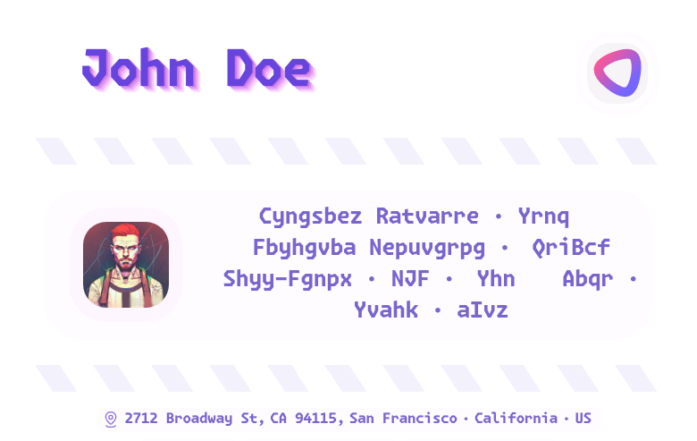

<div align="center">
  <h1>
    
    𐑃⌄𐌒⌃𐣯𐐹
  </h1>
  <i><small>jsonresume theme</small></i><br>
  <a href="https://metaory.github.io/jsonresume-theme-legacy">demo</a> |
  <a href="sample.pdf">sample.pdf</a>
</div>

<p align="center">
  
</p>

---

## USAGE

```sh
# clone
git clone git@github.com:metaory/jsonresume-theme-legacy.git

# navigate
cd jsonresume-theme-legacy

# install dependencies
pnpm install

# run development
pnpm run dev

# view sample page
http://localhost:5173

# build sample pdf
pnpm run build:sample

# duplicate the resume data
cp src/pages/index.json src/pages/private.json

# update the resume data
nvim src/pages/private.json

# customize theme (optional)
# set "theme-hue": 120 and "theme-sat": 5 in meta.themeOptions (JSON-first)
# starts in light mode (matches PDF exports)

# view newly created page
http://localhost:5173/private

# build private pdf
pnpm run build:private
```

> [!TIP]
> Optimizations
>
> for images
> `npm run optimize:images` or `bash optimize-images.sh`
>
> compress final pdf
> `npm run optimize:pdf` or `bash compress-pdf.sh out/private.pdf`
>
> each optimizations comes with its own dependencies,
> read their scripts to learn more


---

## CUSTOMIZATION

### Icons

> [!NOTE]
> [Iconify](https://icon-sets.iconify.design) is used for icons.

> [!NOTE]
> The default icon map is defined in [src/pages/index.json](https://github.com/metaory/jsonresume-theme-legacy/blob/master/src/pages/index.json)
> Under `meta.themeOptions.iconMap`

> [!TIP]
> You can add/overwrite by adding the desired key value in your `private.json`

> [!TIP]
> You can use icons from any collection

For example to add new icon
for keyword `system-design` to have `mingcute:ghost-line` icon,
and to overwrite the `javascript` icon;

```jsonc
{
  // ...
  "meta": {
    "themeOptions": {
      "iconMap": {
        "system-design": "mingcute:ghost-line",
        "javascript": "fluent:code-js-rectangle-16-filled"
      }
      // ...
    }
  }
}
```

> [!IMPORTANT]
> Make sure the keys in `iconMap` are all lowercase
>
> While the keyword do NOT have to be lowercase

> [!TIP]
> the iconify icon name can be in either form
>
> - `hugeicons:ai-view`
> - `hugeicons--ai-view`

> [!CAUTION]
> a complete process restart is needed if overwriting existing icons

---

### Images

> [!TIP]
> Image paths can be remote or local
>
> Local path is from root

```jsonc
{
  "basics": {
    "name": "John Doe",
    "label": "Programmer",
    // remote images
    "image": "https://avatars.githubusercontent.com/u/9919",
    // local private ignored assets
    "logo": "/.dev/my-private-logo.png",
    // ...
  },
  // ...
}
```

---

### Summary

> [!TIP]
> The `basics.summary` is placed as **raw HTML**

---

### Titles

> [!TIP]
> You can change section titles
>
> Under `meta.themeOptions.sectionTitles`

---

### Themes

> [!TIP]
> Use `theme-hue` for infinite color variations (0-360 degrees)
>
> Default: `0` (no rotation). If `theme-hue` is missing, fallback is `0` (or theme-specific like `bush` → `120`).

```jsonc
{
  "meta": {
    "themeOptions": {
      "theme-hue": 300,  // Pink shift (0-360 degrees)
      "theme-sat": 5     // Saturation boost (0-100%)
    }
  }
}
```

> [!TIP]
> **Color System:**
> - Neutral base colors with good saturation/brightness range
> - Global hue rotation applied to all elements (except images)
> - Interactive theme controls with real-time preview
> - Distinct gradient backgrounds for work vs project cards
> - Starts in light mode (matches PDF exports)
> - Manual toggle available for user preference
> - PDF exports always use light mode for optimal printing

> [!TIP]
> **Theme Options:**
> - `theme-hue`: Color hue rotation (0-360 degrees)
> - `theme-sat`: Saturation boost (0-100%, default: 2%)
> - Always starts in light mode (consistent with PDF exports)

> [!TIP]
> **Common Hue Values:**
> - `0` - Default (purple base)
> - `120` - Blue shift
> - `180` - Cyan shift  
> - `240` - Blue shift
> - `300` - Pink shift
> - `60` - Yellow shift

---

### Interactive Theme Controls

> [!TIP]
> **Live Theme Editor:**
> - Real-time hue and saturation sliders in the top-right corner
> - Adjust colors instantly without page reload
> - Values automatically sync with your JSON configuration
> - Perfect for finding the ideal color combination

> [!TIP]
> **Card Gradients:**
> - Work cards: Base hue with enhanced saturation
> - Project cards: 40° hue shift with enhanced saturation
> - Subtle diagonal gradients for visual distinction
> - Responsive to both light and dark themes

---

### Troubleshooting

> [!CAUTION]
> You need the dev script running before running the pdf build script

---

> [!WARNING]
> `sh: line 1: chromium: command not found`
>
> [chromium](https://chromium.org) is used for pdf exports
>
> If you use the proprietary `google-chrome`
> you have to update the [build:private](https://github.com/metaory/jsonresume-theme-legacy/blob/master/package.json) script accordingly

---

> [!NOTE]
> Only tested on Linux
>
> Reconsider your life choices if you're running  💩 Windows!

---

## LICENSE

[MIT](LICENSE)
